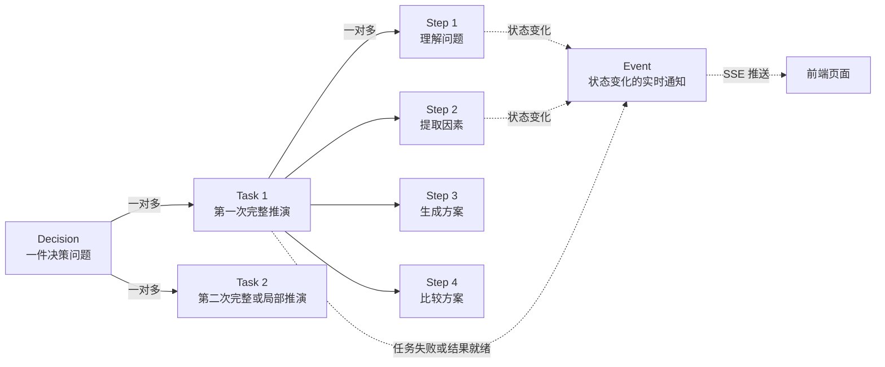
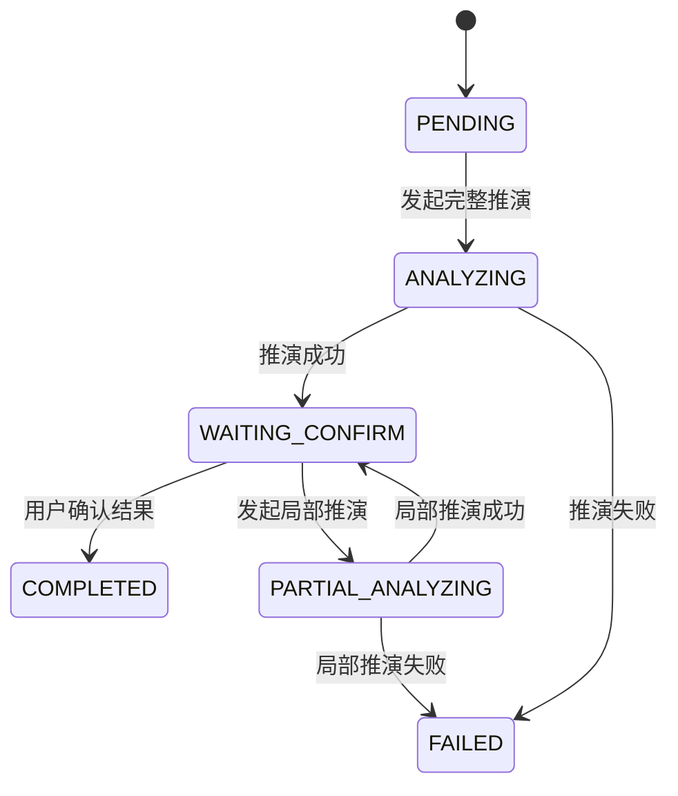
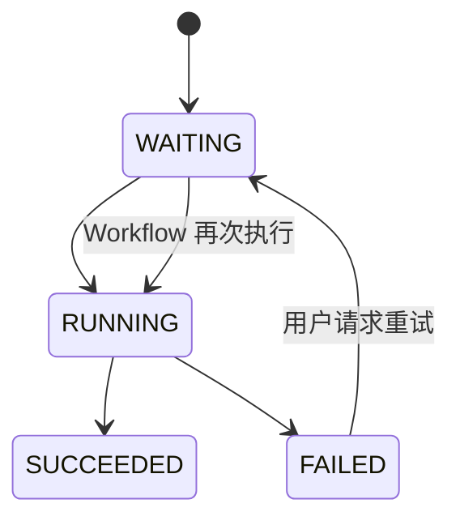
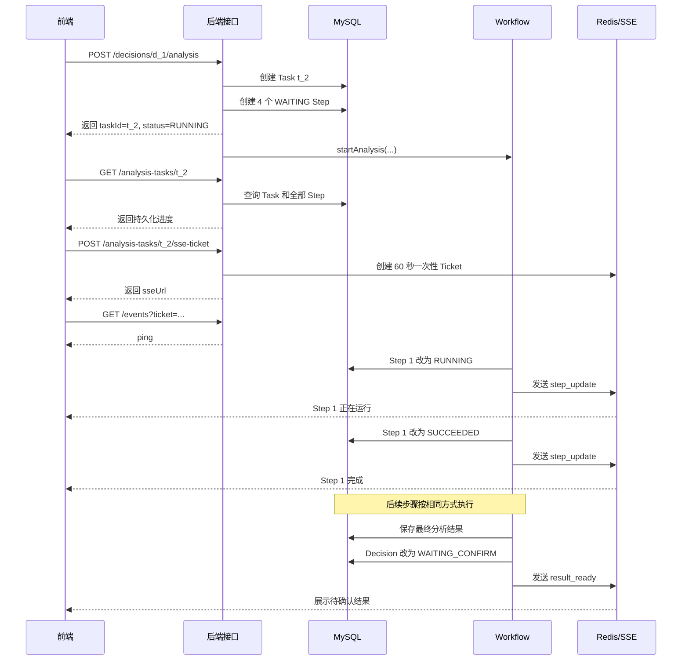

# Decision、Task、Step、Event 关系教学文档

> 适合第一次接触本项目推演模块的同学。

## 1. 先用一句话理解

- **Decision（决策）**：用户想解决的一件事。
- **Task（任务）**：针对这件事发起的某一次 AI 推演。
- **Step（步骤）**：这一次推演中依次执行的具体阶段。
- **Event（事件）**：Task 或 Step 发生变化时，通过 SSE 发给前端的实时通知。

可以把它们想成一次看病：

| 项目概念 | 看病类比 |
| --- | --- |
| Decision | 一个需要解决的健康问题 |
| Task | 针对这个问题进行的一次诊疗 |
| Step | 挂号、检查、诊断、开药等阶段 |
| Event | “检查开始了”“报告出来了”等实时通知 |

最重要的关系是：



## 2. Decision：要解决的原始问题

Decision 对应数据库中的 `decision` 表，是整个业务的根对象。

例如：

```text
标题：一周内准备 Java 后端面试
背景：每天只能学习 2 小时
目标：制定一份高收益学习计划
约束：总时间只有 14 小时
```

它负责保存“用户到底要解决什么”，而不是保存某一次 Workflow 的执行过程。

常用字段：

| 字段 | 含义 |
| --- | --- |
| `id` | 数据库主键，对外显示为 `d_1` |
| `user_id` | 这个决策属于哪个用户 |
| `title` | 决策标题 |
| `background` | 背景信息 |
| `goal` | 想达到的目标 |
| `constraints` | 时间、预算等限制 |
| `status` | 当前整体业务状态 |
| `latest_task_id` | 最近一次推演任务 |
| `pending_result_id` | 等待用户确认的分析结果 |

Decision 常见状态：



## 3. Task：一次具体的推演记录

Task 在 Java 中叫 `AnalysisTask`，对应数据库中的 `agent_run` 表。

同一个 Decision 可以进行多次推演，所以是：

```text
一个 Decision  ---->  多个 Task
```

例如：

```text
d_1：一周内准备 Java 后端面试
 ├─ t_1：第一次完整推演，失败
 ├─ t_2：修改条件后重新完整推演，成功
 └─ t_3：只修改 Redis 学习部分后的局部推演
```

Task 保存的是“一次执行的总体情况”：

| 字段 | 含义 |
| --- | --- |
| `id` | 数据库主键，对外显示为 `t_1` |
| `decision_id` | 这次任务属于哪个 Decision |
| `run_type` | `FULL` 完整推演或 `PARTIAL` 局部推演 |
| `status` | `PENDING / RUNNING / SUCCEEDED / FAILED` |
| `current_step` | 当前执行到第几个步骤 |
| `total_steps` | 一共有多少个步骤 |
| `started_at` | 任务开始时间 |
| `finished_at` | 任务结束时间 |
| `error_message` | 任务最终失败时的原因 |

Task 是“总进度”，Step 是“每一阶段的详细进度”。

## 4. Step：Task 里面的执行阶段

Step 在 Java 中叫 `AnalysisStep`，对应数据库中的 `agent_step` 表。

一个 Task 会有多个 Step：

```text
一个 Task  ---->  多个 Step
```

目前完整推演对前端展示的主要步骤是：

| 顺序 | `step_name` | 中文含义 |
| --- | --- | --- |
| 1 | `UNDERSTAND` | 理解问题 |
| 2 | `EXTRACT_FACTORS` | 提取关键因素 |
| 3 | `GENERATE_OPTIONS` | 生成候选方案 |
| 4 | `COMPARE_OPTIONS` | 比较候选方案 |

Step 常用字段：

| 字段 | 含义 |
| --- | --- |
| `id` | 数据库主键，对外显示为 `s_1` |
| `run_id` | 所属 Task 的数据库 ID |
| `step_order` | 在当前 Task 中的执行顺序 |
| `step_name` | 稳定的英文步骤名 |
| `step_type` | 思考步骤 `THINKING` 或工具步骤 `TOOL_CALL` |
| `status` | `WAITING / RUNNING / SUCCEEDED / FAILED` |
| `input_data` | 这个步骤的输入 |
| `output_data` | 这个步骤的输出 |
| `error_message` | 这个步骤的失败原因 |
| `retry_count` | 已重试次数 |

步骤状态一般按下面的方向变化：



只有 `FAILED` 的步骤允许重试，而且它前面的步骤必须已经成功。成功步骤不能重复执行。

## 5. Event：告诉前端“刚刚发生了什么”

Event 不是 Decision、Task、Step 之外的另一层业务数据。

它更像一封实时通知：

```text
Step 状态发生变化
        ↓
后端更新数据库
        ↓
后端生成 Event
        ↓
通过 SSE 推送给前端
        ↓
前端立即更新进度条和步骤卡片
```

当前实现中：

- Decision、Task、Step 持久化在 MySQL。
- SSE Ticket、最新 `eventId` 等临时数据保存在 Redis。
- SSE 连接对象保存在当前后端实例的内存中。
- Event 通过 SSE 实时发送，本身不是 `agent_event` 数据库表。

标准事件：

| event | 用途 |
| --- | --- |
| `step_update` | 步骤开始、成功、失败或内容发生变化 |
| `tool_call` | Workflow 开始或完成一次工具调用 |
| `result_ready` | 最终分析结果已经生成并等待用户确认 |
| `task_failed` | 整个 Task 最终失败 |
| `ping` | 保持 SSE 连接，防止代理认为连接超时 |

一个事件示例：

```text
id: evt_19
event: step_update
data: {
  "taskId": "t_2",
  "stepId": "s_5",
  "status": "RUNNING",
  "summary": "正在理解问题",
  "content": "正在分析用户的背景、目标和时间约束……",
  "progress": 0
}
```

## 6. taskId、stepId、eventId 到底有什么区别

| ID | 指向什么 | 是否对应 MySQL 主键 | 主要作用 |
| --- | --- | --- | --- |
| `decisionId` | 一件决策问题 | 是，`d_1` 对应 `decision.id=1` | 找到用户要解决的问题 |
| `taskId` | 某一次推演 | 是，`t_2` 对应 `agent_run.id=2` | 查询进度、获取 Ticket |
| `stepId` | 某一次任务中的一个步骤 | 是，`s_5` 对应 `agent_step.id=5` | 标识更新或重试哪个步骤 |
| `eventId` | 一条 SSE 通知 | 当前不对应 MySQL 业务表 | 标记实时通知的先后顺序 |

注意：

- `stepId` 是数据库主键，不等于 `step_order`。
- `s_5` 可能是某个 Task 的第 1 步，因为前面的 Task 已经创建过 `s_1` 到 `s_4`。
- `eventId` 只表示事件顺序，例如 `evt_19`、`evt_20`。
- ID 前缀是 API 展示格式，数据库内部仍然使用 `BIGINT`。

## 7. 一次完整推演是怎样跑起来的

下面是前后端看到的完整时间线：



## 8. 为什么前端既要 GET Task，又要连接 SSE

因为二者职责不同：

| 方式 | 回答的问题 |
| --- | --- |
| `GET /analysis-tasks/{taskId}` | “当前完整状态是什么？” |
| SSE Event | “从连接建立以后，刚刚发生了什么变化？” |

SSE 可能断线、浏览器可能刷新，所以不能只依赖 SSE。

正确顺序：

1. 页面先 GET Task，拿到数据库中完整、可靠的 Task 和 Steps。
2. 再获取一次性 SSE Ticket。
3. 使用 Ticket 建立 SSE 连接，接收后续变化。
4. SSE 断线时显示“连接恢复中”，重新 GET Task。
5. 再申请新 Ticket 并重新连接。

一句话记忆：

> MySQL 中的 Task 和 Step 是事实，SSE Event 是通知。

## 9. 失败和重试时会发生什么

假设 `UNDERSTAND` 执行失败：

```text
Decision d_1
└─ Task t_2：FAILED
   ├─ Step s_5 UNDERSTAND：FAILED
   ├─ Step s_6 EXTRACT_FACTORS：WAITING
   ├─ Step s_7 GENERATE_OPTIONS：WAITING
   └─ Step s_8 COMPARE_OPTIONS：WAITING
```

后端会：

1. 把 `s_5` 更新为 `FAILED`。
2. 把 `t_2` 更新为 `FAILED`。
3. 发送 `task_failed` 和 `step_update`。
4. GET Task 时返回：

```json
{
  "status": "FAILED",
  "error": {
    "code": 50001,
    "message": "AI 服务调用失败",
    "retryable": true,
    "failedStepId": "s_5"
  }
}
```

用户点击重试后：

```text
POST /analysis-tasks/t_2/steps/s_5/retry
```

步骤先回到 `WAITING`，然后 Workflow 从对应节点继续执行。已经成功的前置步骤不需要重新运行。

## 10. 最容易搞错的几个地方

### 误区一：一个 Decision 只有一个 Task

错误。同一个 Decision 可以完整推演多次，也可以局部推演多次。

### 误区二：Task 和 Step 是同一个东西

错误。Task 是一次推演的总记录，Step 是推演中的具体阶段。

### 误区三：Event 是最终数据

错误。Event 只是通知。页面刷新后应重新 GET Task，从数据库恢复状态。

### 误区四：eventId 就是 stepId

错误。`stepId` 标识步骤，`eventId` 标识第几条实时通知。同一个 Step 可以产生很多 Event。

例如：

```text
evt_19：s_5 变为 RUNNING
evt_20：s_5 的 content 更新
evt_21：s_5 变为 SUCCEEDED
```

### 误区五：重试会重新创建一个 Task

当前接口不是这样。步骤重试继续使用原 Task 和原 Step，只更新状态及 `retry_count`。

## 11. 当前代码中的对应位置

| 内容 | Java 类或位置 |
| --- | --- |
| Decision 实体 | `entity/Decision.java` |
| Task 实体 | `entity/AnalysisTask.java` |
| Step 实体 | `entity/AnalysisStep.java` |
| 发起和查询任务 | `service/impl/AnalysisTaskServiceImpl.java` |
| Workflow 节点事件监听 | `workflow/listener/NodeExecutionEventListener.java` |
| SSE Ticket 和事件发送 | `service/impl/AnalysisEventServiceImpl.java` |
| Redis 临时状态 | `repository/TaskRuntimeRepository.java` |
| 7–8 Controller | `controller/AnalysisEventController.java`、`controller/AnalysisTaskController.java` |

## 12. 当前尚待接入的部分

目前基础链路已经存在，但下面两类事件仍需要其他模块提供真实数据后接入：

- Workflow 工具调用事件接入后发送 `tool_call`。
- 最终 `analysis_result` 落库后发送 `result_ready`。

此外，`step_update` 应保证：

- `summary` 始终是可展示的简短标题。
- `content` 是当前完整的详细文本。
- 同一个 Step 多次发送 `content` 时，前端使用最新值覆盖旧值。

---

最后用一行总结：

```text
Decision 是要解决的事
  └─ Task 是一次推演
      └─ Step 是推演中的阶段
          └─ Event 是阶段变化时发给前端的实时通知
```
